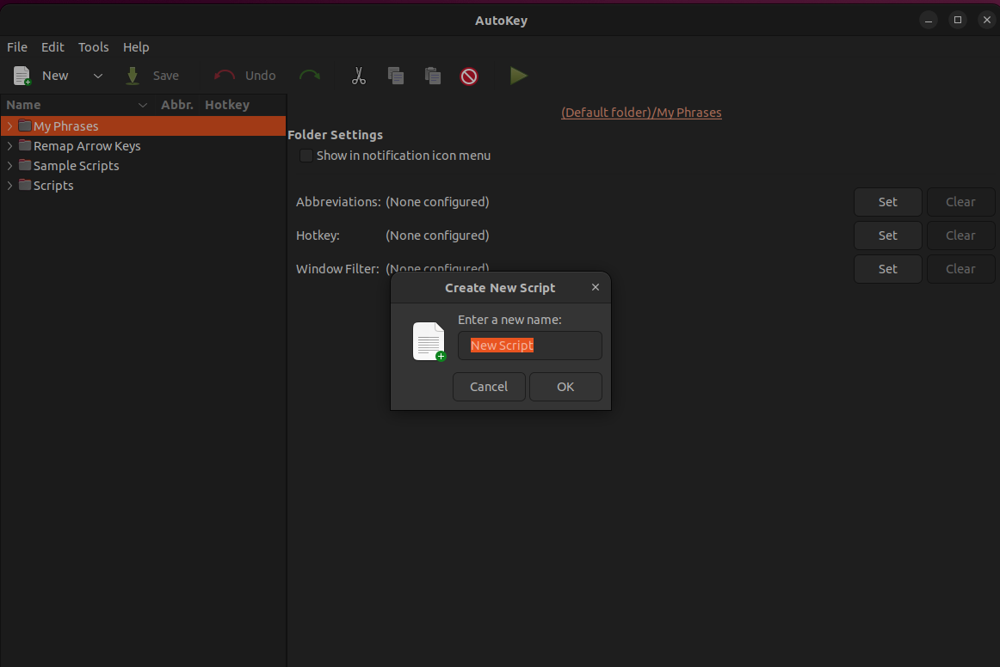
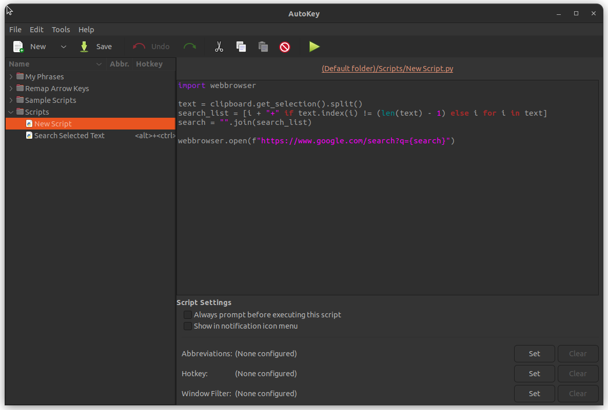
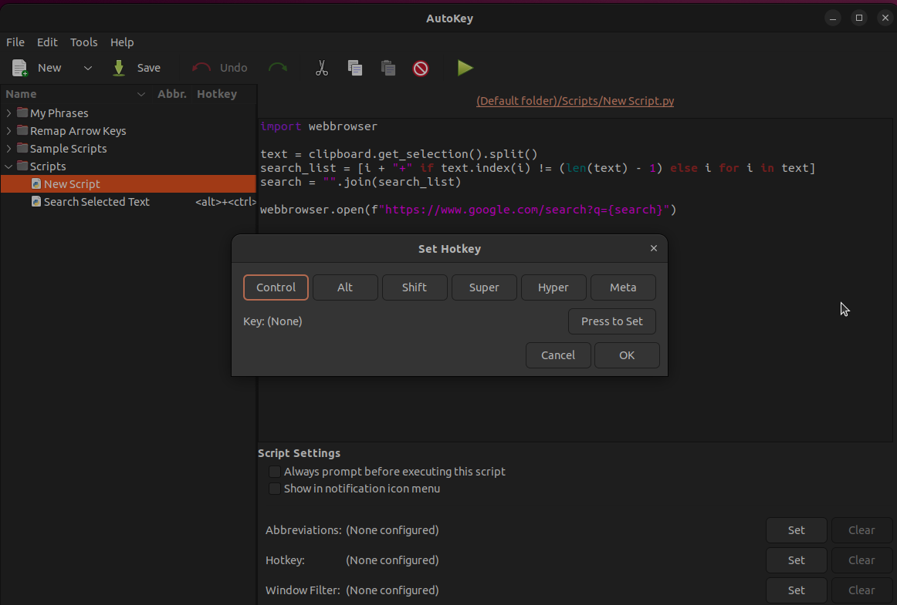

# Linux-AutoKey-Python-Scripts


## Install

Run command to install on Debian-based Linux distros:

```
sudo apt install autokey-gtk
```

On Fedora:

```
sudo dnf install autokey-gtk
```

On Arch Linux:

```
yay -Syy autokey-gtk
```

## Adding Scripts

Open AutoKey and click 'New'




Paste the code into the script




Set the hotkey to execute the script


